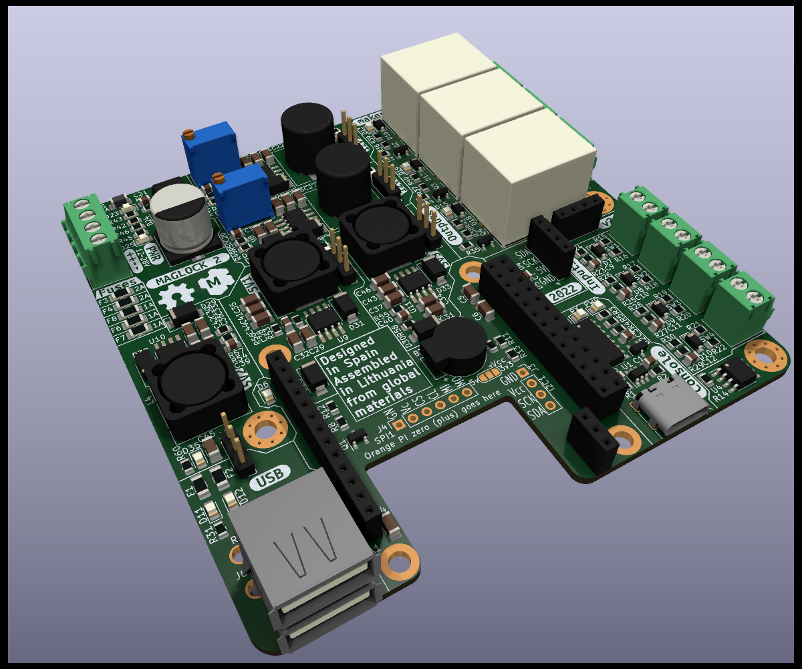

MagLock is the entrance controller hardware. It features:

* 2 USB ports for RFID readers
* 3 outputs to electrically controll door (for example, lock/unlock and open/close)
* 4 inputs for normally open switches (for example, doorbell, inside exit button, door position endstops)
* 100Mbps Ethernet for comunication
* onboard UART USB adapter for easy debuging
* onboard DS18B20 1-wire thermometer
* optional I2C oled screen
* additional I2C and SPI breakout for expansion

### Dev NOTEs

* before commit, run `./kibot.sh` to regenerate documentation, bom, gerbers and other assets.
* before fixes after release, bump the version including qr code to next odd value
* before release, bump version to next even value on:
  * every page of schematics and pcb
  * label on front silkscreen
  * qr-code link on bottom silkscreen

* [schematics.pdf](gen/schematics.pdf)
* [pcb.pdf](gen/pcb.pdf)
* [ibom.html](gen/bom_ibom.html)
* [gerbers.zip](gen/gerbers/gerbers.zip)

